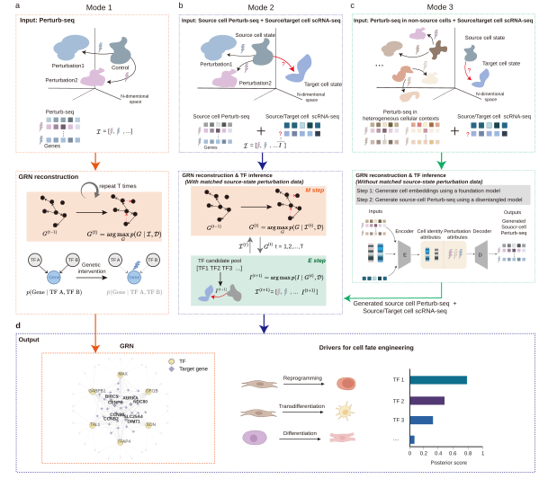

# PerturbGRN
[](https://doi.org/10.5281/zenodo.21353502)

PerturbGRN is a probabilistic framework for reconstructing gene regulatory
networks (GRNs) from single-cell perturbation data and prioritizing
transcription factors that drive cell-state transitions.

PerturbGRN supports three analysis modes according to the biological task and
data availability. Mode 1 reconstructs a perturbation-informed GRN for a given
cell type. Mode 2 jointly reconstructs the source-cell GRN and prioritizes
transition-associated driver transcription factors (TFs) using matched
source-cell Perturb-seq together with source- and target-cell scRNA-seq. Mode 3
extends this joint inference to settings without matched source-state
Perturb-seq by generating pseudo source-cell perturbation profiles from
Perturb-seq data collected in heterogeneous cellular contexts.

<p align="center">
  
</p>

## 1. Workflow overview

| Mode | Task | Main input | Environment | Entry point |
| --- | --- | --- | --- | --- |
| **Mode 1** | Perturbation-informed GRN reconstruction | Perturb-seq from the cell type of interest | `perturbgrn` | `main/main.py` with `MODE = "grn"` |
| **Mode 2** | Joint GRN reconstruction and transition-driver inference | Matched source-cell Perturb-seq plus source- and target-cell scRNA-seq | `perturbgrn` | `main/main.py` with `MODE = "driver"` |
| **Mode 3** | Joint GRN reconstruction and transition-driver inference without matched source-state Perturb-seq | Perturb-seq from other cellular contexts plus source- and target-cell scRNA-seq | `perturbgrn_mode3` and `perturbgrn` | `main/run_mode3_biolord_driver.sh` |

## 2. Installation

Clone the repository and enter its root directory before running the commands
below.

### 2.1 Main PerturbGRN environment for Mode 1/2

Modes 1 and 2 require only the main `perturbgrn` environment:

```bash
conda env create --solver libmamba -f environment.yml
conda activate perturbgrn
```

The environment uses Python 3.10 and installs the local PerturbGRN package and
its pinned dependencies. Alternatively, create a Python 3.10 environment and
run `pip install .` from the repository root.

### 2.2 Extra `perturbgrn_mode3` environment for Mode 3

Mode 3 requires both environments: the separate Python 3.9
`perturbgrn_mode3` environment generates pseudo source-cell Perturb-seq, and
the main `perturbgrn` environment performs data conversion and joint GRN and
driver inference. The additional environment does not replace or extend the
main environment.

```bash
conda env create --solver libmamba -f environment_cpa.yml
conda activate perturbgrn_mode3
```

PyTorch must be installed separately. The following combination is the configuration tested for this
repository on an NVIDIA GPU with CUDA 11.7:

```bash
pip install torch==2.0.1 torchvision==0.15.2 torchaudio==2.0.2 \
  --index-url https://download.pytorch.org/whl/cu117
```

Do not use the CUDA 11.7 command unchanged when the machine requires another
CUDA/ROCm build or has no compatible GPU. Select the build for the local
hardware from the official
[PyTorch installation guide](https://pytorch.org/get-started/locally/) or its
[previous-version instructions](https://pytorch.org/get-started/previous-versions/).
The Mode 3 workflow was validated with PyTorch 2.0.1. After installing PyTorch, install the remaining Mode 3 dependencies:

```bash
pip install --no-deps cpa-tools==0.8.3
pip install -r requirements_cpa.txt
```

Verify the installation before running Mode 3:

```bash
python -c "import torch; print(torch.__version__); print('CUDA available:', torch.cuda.is_available())"
```

If GPU execution is expected, `CUDA available` should print `True`.


When both environments use the documented names and `conda` is available on
`PATH`, the Mode 3 shell script resolves both Python executables automatically;
no environment activation or manual export is required. Only define explicit
paths for non-standard environment names, schedulers, or non-interactive
shells where `conda` is unavailable:

```bash
export CPA_PYTHON="$(conda run -n perturbgrn_mode3 python -c 'import sys; print(sys.executable)')"
export PERTURBGRN_PYTHON="$(conda run -n perturbgrn python -c 'import sys; print(sys.executable)')"
```

## 3. Input format

### 3.1 PerturbGRN input for Mode 1/2

Modes 1 and 2 use an AnnData file and a cell-order JSON file referring to the
same cells.

| AnnData field | Required | Description |
| --- | --- | --- |
| `adata.X` | Yes | Preprocessed expression matrix. Rows are cells and columns are genes. Use one consistent normalization scheme across all cells. |
| `adata.var["gene"]` | Yes | Gene symbol for every column. If absent, the code can fall back to `adata.var["gene_name"]` or `adata.var_names`. Gene symbols should be unique. |
| `adata.obs["pert"]` | Yes | Perturbation/state label for every cell. Use `CTRL` for controls and source-state scRNA-seq and gene symbols for known interventions. In Mode 2, the target-state label must match `TARGET_PERT_LABEL`; its default is `unknown`. |
| `adata.obs["label"]` | Mode 1: No; Mode 2: Yes | In Mode 2, use `train` for the matched source-cell Perturb-seq and `test` for the source- and target-cell scRNA-seq profiles. |

For Mode 1, the keys in `cell_order.json` should match perturbation labels in
`adata.obs["pert"]`, including `CTRL`. For Mode 2, the file must include
`CTRL` and the trajectory named by `TARGET_PERT_LABEL`. The label is usually
`unknown`, but it may retain an experimental label such as
`PU.1+IRF8+BATF3` in the Fib2DC example.

The JSON maps each perturbation label to ordered, zero-based row positions in
the same AnnData object:

```json
{
  "CTRL": [0, 12, 31, 45],
  "TF1": [2, 9, 18],
  "unknown": [101, 118, 125]
}
```

PerturbGRN forms adjacent cell pairs from each ordered list. Therefore, all
indices must be valid row positions and must preserve the intended trajectory
order. An optional sibling file named `cell_order_meta.json` can record
trajectory boundaries; it is detected automatically when present.

Mode 1 can optionally evaluate a reconstructed network against
`GROUND_TRUTH_PATH`. Set `SELECTED_TF_JSON` only when evaluation should be
restricted to specific TFs. The JSON must be a unique list of TF
symbols, for example `Data/examples/selected_tf_example.json`:

```json
["GATA4", "SRY", "SOX9"]
```

`SELECTED_TF_JSON` requires `GROUND_TRUTH_PATH` and does not affect GRN
training. Leave `SELECTED_TF_JSON = None` to evaluate all regulator rows.

### 3.2 Generation input for Mode 3

The shell workflow requires three data inputs and accepts
a root-marker file for pseudotime construction:

| Input | Default path | Requirement |
| --- | --- | --- |
| Merged generation AnnData | `Data/mode3/t2ctl/adata_decoupled_generation_input.h5ad` | Contains Perturb-seq collected from other cellular contexts together with source-state cells. |
| Cell-context embedding | `Data/mode3/t2ctl/CellTypeEmbedding.pkl` | Pickle/joblib dictionary keyed by cell context. |
| Target-state scRNA-seq | `Data/mode3/t2ctl/target_scrna.h5ad` | Real target-state cells. |
| Root-state markers | Set with `MARKER_FILE` | Optional plain-text file with one gene symbol per line. Recommended when `TARGET` is not a T-cell context. |

The merged generation AnnData must satisfy this schema:

| Field | Required | Requirement |
| --- | --- | --- |
| `adata.layers["logNor"]` | Yes | Numeric normalized log1p expression matrix used for model training; its shape must equal `adata.X.shape`. |
| `adata.obs["condition1"]` | Yes | Cell type or source context for every cell. The value selected by `TARGET` must be present. |
| `adata.obs["condition2"]` | Yes | Perturbation condition for every cell. Controls must be labeled exactly `control`; other values should be perturbed gene symbols. |
| `adata.var_names` | Yes | Unique gene symbols in the same order for every row and layer. Ensembl identifiers should be converted before running Mode 3. |
| `adata.X` | Yes | Numeric matrix with the same cells and genes as `layers["logNor"]`. |

Both AnnData files must use compatible gene symbols and expression scales. The
target-state scRNA-seq must have preprocessed expression in `X` and unique gene
symbols in `var_names`.

The embedding file must contain a dictionary. Its keys must cover every value
in `adata.obs["condition1"]`; each value must be a non-empty numeric 1D vector,
and all vectors used in one run must have the same length. For example:

```python
{
    "k562": numpy.ndarray(shape=(embedding_dim,)),
    "fib": numpy.ndarray(shape=(embedding_dim,)),
    "T": numpy.ndarray(shape=(embedding_dim,)),
}
```

The converter orders control cells with diffusion pseudotime. It selects the
root control cell by the highest score over the supplied root-state markers.
When `MARKER_FILE` is omitted, the historical built-in T-cell marker set is
used, regardless of the value of `TARGET`. For a non-T target, provide markers
that characterize the intended starting/root state. Markers absent from the
merged gene set are ignored; conversion stops if none of the supplied markers
is present.

## 4. Running experiments

Run all commands from the repository root.

### 4.1 Running your own data

The files named `example_config_*` are annotated starting points for new
datasets. Their paths are intentionally placeholders; update them before
running.

#### 4.1.1 Mode 1: reconstruct a GRN

Prepare a Perturb-seq AnnData and matching cell-order JSON according to the
Mode 1 schema above. Copy the generic example config, then edit `SCENARIO`,
`ADATA_PATH`, `CELLORDER_FILE`, `OUTPUT_DIR`, and optionally
`GROUND_TRUTH_PATH` and `SELECTED_TF_JSON`:

```bash
conda activate perturbgrn
cp main/example_config_mode1.py main/config.py
# Edit the repository-relative paths in main/config.py.
python main/main.py
```

The placeholder config illustrates this layout:

```text
Data/my_mode1/perturbseq.h5ad
Data/my_mode1/cell_order.json
```

The default output is `outputs/my_mode1_grn/`. Set `GROUND_TRUTH_PATH = None`
when no reference network is available; GRN reconstruction will still run.

#### 4.1.2 Mode 2: jointly reconstruct a source-cell GRN and prioritize transition drivers

Prepare a PerturbGRN-ready AnnData containing matched source-cell Perturb-seq,
source-cell scRNA-seq, and target-cell scRNA-seq, together with a matching
cell-order JSON. Copy the generic example config and edit its experiment/path
fields and `TARGET_PERT_LABEL`:

```bash
conda activate perturbgrn
cp main/example_config_mode2.py main/config.py
# Edit the repository-relative paths in main/config.py.
python main/main.py
```

The placeholder config illustrates this layout:

```text
Data/my_mode2/perturbgrn_input.h5ad
Data/my_mode2/cell_order.json
```

The default output is `outputs/my_mode2_driver/`. It contains posterior score
snapshots, the final TF ranking, and intermediate network states.

#### 4.1.3 Mode 3: jointly reconstruct a source-cell GRN and prioritize transition drivers without matched source-state Perturb-seq

Prepare the three required files
and pass their paths to the shell workflow. The bundled workflow uses BioLord
as one implementation of the disentangled perturbation-response generation
module described in the paper:

```bash
MODE3_DIR=Data/my_mode3 \
MERGED_ADATA=Data/my_mode3/merged_input.h5ad \
CELL_EMBEDDING=Data/my_mode3/CellTypeEmbedding.pkl \
TARGET_SCRNA=Data/my_mode3/target_scrna.h5ad \
TARGET=T \
MAX_ITER=10000 \
bash main/run_mode3_biolord_driver.sh
```

The command above omits `MARKER_FILE` and therefore uses the built-in T-cell
markers. For another target context, create a text file containing one
root-state marker gene symbol per line and pass it to the same shell workflow:

```text
RUNX1
GATA2
TAL1
LMO2
```

```bash
TARGET=HSC \
MARKER_FILE=Data/my_mode3/hsc_root_markers.txt \
bash main/run_mode3_biolord_driver.sh
```

A small merged AnnData example is tracked at
`Data/examples/mode3_merged_input_example.h5ad`. It is only a schema example,
not a dataset for training a generation model or running the complete shell
workflow. It can be inspected with:

```bash
python - <<'PY'
import scanpy as sc

adata = sc.read_h5ad("Data/examples/mode3_merged_input_example.h5ad")
print(adata)
print(adata.obs[["condition1", "condition2"]])
print("layers:", list(adata.layers))
print("genes:", adata.var_names.tolist())
PY
```


### 4.2 Dataset-specific examples

These commands reproduce the configured repository examples. All processed
datasets required for these examples are available from
[Zenodo](https://doi.org/10.5281/zenodo.21353502). The downloaded data are
organized into `mode1`, `mode2`, and `mode3`. Place those three directories
directly under the repository's `Data/` directory:

```text
Data/mode1/
Data/mode2/
Data/mode3/
```

See [Example data layout](#5-example-data-layout) for the expected filenames.

#### 4.2.1 Mode 1 example: GSD GRN reconstruction

The tested GSD config uses `Data/mode1/GSD/GSD.h5ad`,
`Data/mode1/GSD/cell_order.json`, and
`Data/mode1/GSD/refNetwork.csv`:

```bash
conda activate perturbgrn
cp main/config_beeline_gsd.py main/config.py
python main/main.py
```

Results are written to `reproducibility_outputs/mode1_gsd/`. For the K562
example, use `main/config_k562_grn.py`.

#### 4.2.2 Mode 2 example: joint GRN reconstruction and driver inference

The bundled Mode 2 example uses the Fib2DC transition:

```text
Data/mode2/fib2dc/perturbgrn_input.h5ad
Data/mode2/fib2dc/cell_order.json
```

 Run:

```bash
conda activate perturbgrn
cp main/config_driver_tf.py main/config.py
python main/main.py
```

Outputs are written to `reproducibility_outputs/mode2_fib2dc/`.

#### 4.2.3 Mode 3 example: joint GRN reconstruction and driver inference without matched source-state Perturb-seq

The Mode 3 example uses the T2CTL data under `Data/mode3/t2ctl/`.
Run:

```bash
bash main/run_mode3_biolord_driver.sh
```

The shell trains the generation model, generates pseudo source-cell
Perturb-seq, converts the result, writes a driver config snapshot, and runs
PerturbGRN joint GRN and driver inference. Outputs are written under
`Data/mode3/t2ctl/` by default. This default command uses the built-in
T-cell root markers. Set `TARGET` and `MARKER_FILE` as shown above for another
cell type.

## 5. Example data layout

```text
PerturbGRN/
├── Data/
│   ├── mode1/
│   │   ├── GSD/
│   │   │   ├── GSD.h5ad
│   │   │   ├── cell_order.json
│   │   │   └── refNetwork.csv
│   │   ├── HSC/
│   │   ├── mCAD/
│   │   ├── VSC/
│   │   └── k562/
│   │       ├── k562.h5ad
│   │       └── cell_order.json
│   ├── mode2/
│   │   ├── fib2dc/
│   │   │   ├── perturbgrn_input.h5ad
│   │   │   └── cell_order.json
│   │   ├── fib2ipsc/
│   │   └── psc2cm/
│   ├── mode3/
│   │   └── t2ctl/
│   │       ├── adata_decoupled_generation_input.h5ad
│   │       ├── CellTypeEmbedding.pkl
│   │       ├── target_scrna.h5ad
│   │       ├── root_markers.txt              # optional
│   │       ├── biolord_outputs/
│   │       ├── perturbgrn_input.h5ad
│   │       ├── cell_order.json
│   │       └── perturbgrn_driver_output/
│   ├── examples/
│   │   ├── mode3_merged_input_example.h5ad
│   │   └── selected_tf_example.json
│   └── reference/
│       └── Homo_sapiens_TF.txt
├── main/
│   ├── config.py
│   ├── config_beeline_gsd.py
│   ├── config_driver_tf.py
│   ├── example_config_mode1.py
│   ├── example_config_mode2.py
│   ├── run_mode3_biolord_driver.sh
│   └── main.py
└── README.md
```

## 6. Configurable parameters

Only the following parameters normally need to be changed.

### 6.1 Mode 1/2 config

| Parameter | Purpose |
| --- | --- |
| `MODE` | `"grn"` for Mode 1 or `"driver"` for Mode 2. |
| `SCENARIO` | Short run name used to identify the experiment. |
| `ADATA_PATH` | Input AnnData path. |
| `CELLORDER_FILE` | Matching cell-order JSON path. |
| `OUTPUT_DIR` | Directory for run outputs. |
| `MAX_ITER` | Maximum number of edge-addition iterations. |
| `TARGET_PERT_LABEL` | Mode 2 only: target-trajectory label shared by `adata.obs["pert"]` and `cell_order.json`; default `"unknown"`. |
| `DRIVER_EARLY_STOP` | Mode 2 only: whether to stop after the configured low-gain window; default `True`. |
| `GROUND_TRUTH_PATH` | Mode 1 only: optional reference network for evaluation; use `None` to skip evaluation. |
| `SELECTED_TF_JSON` | Mode 1 only: optional JSON list restricting ground-truth metrics to specified TF rows; requires `GROUND_TRUTH_PATH`. |

The TF reference is fixed internally at
`Data/reference/Homo_sapiens_TF.txt`.

### 6.2 Mode 3 environment variables

| Variable | Default | Purpose |
| --- | --- | --- |
| `MODE3_DIR` | `Data/mode3/t2ctl` | Base directory for Mode 3 inputs and outputs. |
| `MERGED_ADATA` | `$MODE3_DIR/adata_decoupled_generation_input.h5ad` | User-prepared merged generation AnnData. |
| `CELL_EMBEDDING` | `$MODE3_DIR/CellTypeEmbedding.pkl` | Cell/source embedding dictionary. |
| `TARGET_SCRNA` | `$MODE3_DIR/target_scrna.h5ad` | Target-state scRNA-seq. |
| `TARGET` | `T` | Target value in `obs["condition1"]`. |
| `MARKER_FILE` | unset | Optional root-state marker file used to orient control-cell pseudotime. If unset, the built-in T-cell markers are used. |
| `MAX_ITER` | `10000` | Maximum PerturbGRN iterations. |


## 7. Outputs

PerturbGRN writes results under `OUTPUT_DIR`:

| Output | Description |
| --- | --- |
| `cp_adj_<iteration>.npy` | Saved network state; nonzero entries record selected edges. |
| `score_arrays_<iteration>.pkl` | Intermediate likelihood and edge-score state. |
| `ll.csv` | Selected edge and likelihood-improvement history. |
| `metrics_log.csv` | Mode 1 evaluation metrics when a ground-truth network is configured. |
| `pt_score.csv` | Mode 2/3 posterior driver-score snapshots, recorded every 1,000 iterations and once at termination. |
| `final_tf_ranking.json` | Mode 2/3 final TF names ordered by posterior score from highest to lowest. |
| `driver_stop_summary.json` | Early-stopping summary when the driver stopping criterion is reached. |

Mode 3 additionally writes generated pseudo Perturb-seq profiles, the converted
`perturbgrn_input.h5ad`, its `cell_order.json`, and a snapshot of the generated
driver config under `Data/mode3/t2ctl/` by default.


## 8. Contact

For questions, contact `jingya_yang@tongji.edu.cn` and `bm2-lab@tongji.edu.cn`.
